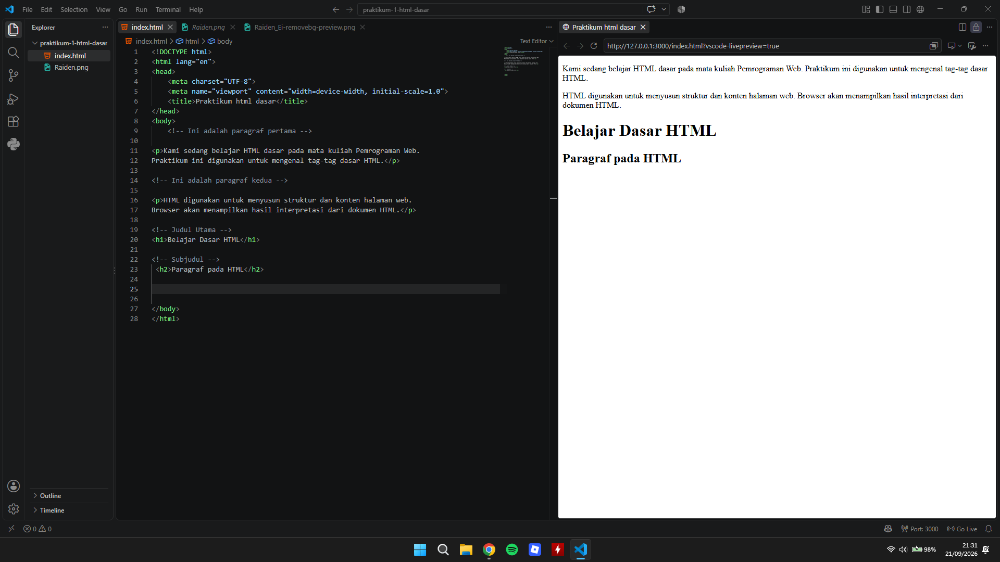
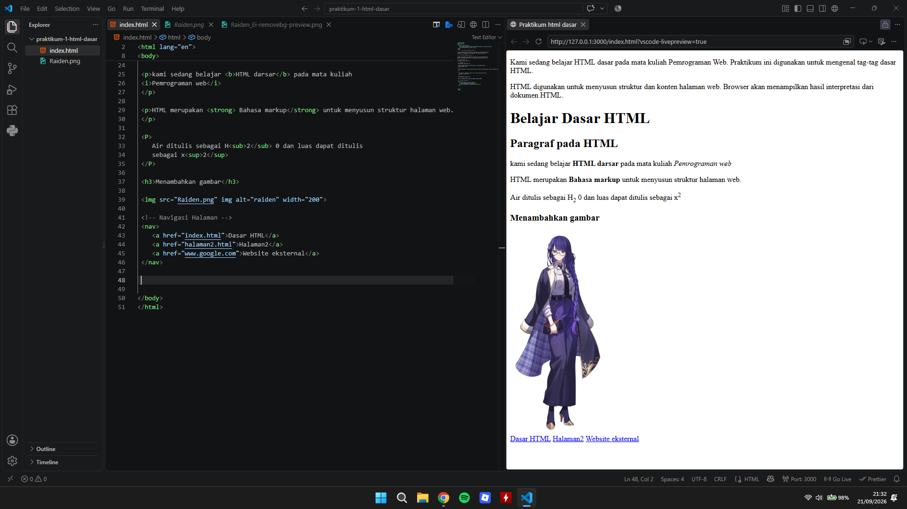
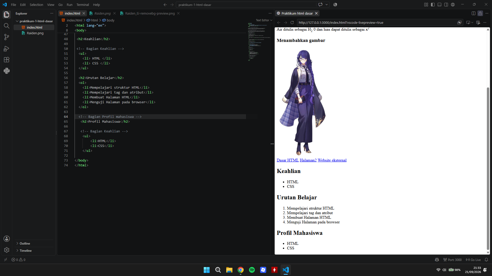
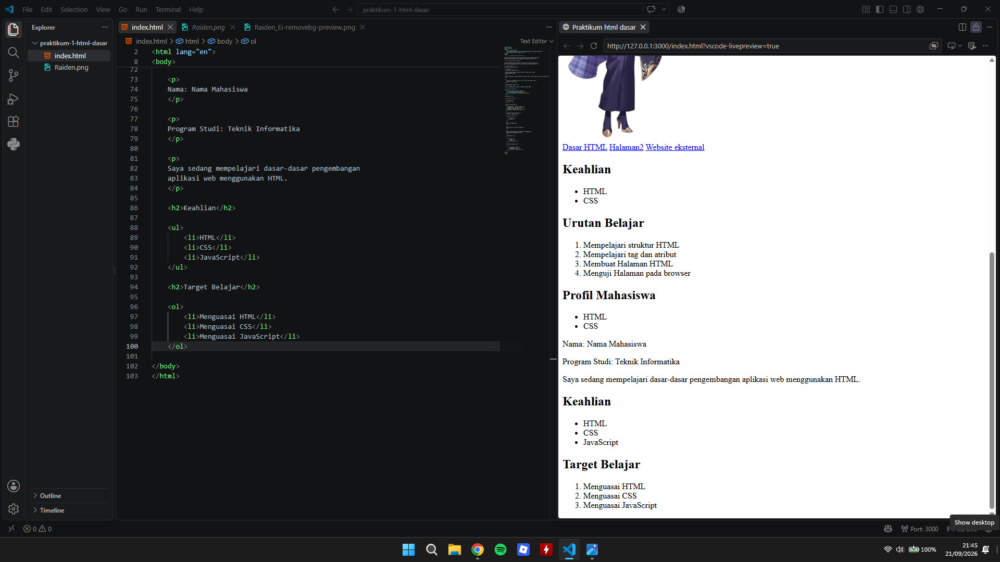

## Langkah 1 - Membuat Paragraf dan Heading

Pada tahap ini, dibuat dua paragraf sederhana menggunakan tag `
`.
Kemudian ditambahkan judul utama menggunakan tag `<h1>` dan subjudul
menggunakan tag `<h2>`.

Hasil dari tahap ini dapat dilihat pada gambar berikut:

## Tahap 2: Pembuatan Paragraf, Format Teks, Gambar, dan Navigasi Hyperlink

Pada tahap 2 praktikum ini, dilakukan pembuatan elemen-elemen dasar HTML pada file `index.html`:

 Format Teks dan Paragraf (`
`):
   - Menambahkan tag `
` untuk membuat paragraf.
   - Menggunakan tag `<b>` untuk menebalkan teks (*bold*) dan tag `<i>` untuk cetak miring (*italic*).
   - Menggunakan tag `<strong>` untuk memberikan penekanan penting pada teks.
   - Menggunakan tag `` (*subscript*) untuk penulisan angka bawah (seperti rumus kimia $H_2O$) dan tag `` (*superscript*) untuk penulisan pangkat (seperti $x^2$).

 Menambahkan Gambar (``):
   - Menampilkan gambar karakter `Raiden.png` menggunakan tag `` dengan lebar yang disesuaikan menjadi 200 piksel.

 Navigasi dan Link (`<nav>` & `<a>`):
   - Membuat navigasi tautan menggunakan tag `<nav>` dan tag `<a>` dengan atribut `href`:
     - Navigasi internal ke halaman `index.html` dan `halaman2.html`.
     - Tautan eksternal mengarah ke `www.google.com`.

Hasil dari tahap ini dapat dilihat pada gambar berikut:

## Tahap 3: Pembuatan Daftar (List) dan Komentar HTML

Pada tahap 3, dilanjutkan dengan pembuatan daftar (*list*) terurut maupun tidak terurut beserta penggunaan komentar:

Unordered List (`<ul>` dan `<li>`):
   - Digunakan untuk menampilkan daftar item yang tidak berurutan (ditandai dengan bullet/titik), seperti pada bagian **Keahlian** (`HTML`, `CSS`).
   
Ordered List (`<ol>` dan `<li>`):
   - Digunakan untuk menampilkan daftar item yang berurutan (ditandai dengan nomor), seperti pada bagian **Urutan Belajar** (Mempelajari struktur HTML, tag dan atribut, membuat halaman HTML, dan menguji halaman pada browser).

Komentar HTML (`<!-- ... -->`):
   - Menambahkan komentar di dalam kode (seperti `<!-- Bagian Keahlian -->` dan `<!-- Bagian Profil mahasiswa -->`) untuk memberikan keterangan pada kode tanpa ikut ditampilkan di dalam peramban (*browser*).

Hasil dari tahap ini dapat dilihat pada gambar berikut:

## Tahap 4: Pembuatan Profil Mahasiswa dan Target Belajar

Pada tahap akhir ini, dilakukan penambahan informasi identitas serta target pembelajaran pada bagian bawah dokumen `index.html`:

Informasi Identitas / Bio (`
`):
   - Menambahkan beberapa paragraf yang memuat detail data diri seperti Nama, Program Studi (*Teknik Informatika*), dan deskripsi aktivitas belajar[cite: 7].

Pembaruan Daftar Keahlian (`<h2>` & `<ul>`)**:
   - Menambahkan judul bagian dengan `<h2>Keahlian</h2>` dan melengkapi daftar keahlian tak terurut (*unordered list*) dengan item baru yaitu `JavaScript`[cite: 7].

Bagian Target Belajar (`<h2>` & `<ol>`):
   - Menambahkan judul `<h2>Target Belajar</h2>` serta daftar berurutan (*ordered list*) yang memuat target pencapaian: *Menguasai HTML*, *Menguasai CSS*, dan *Menguasai JavaScript*[cite: 7].

Hasil dari tahap ini dapat dilihat pada gambar berikut:
